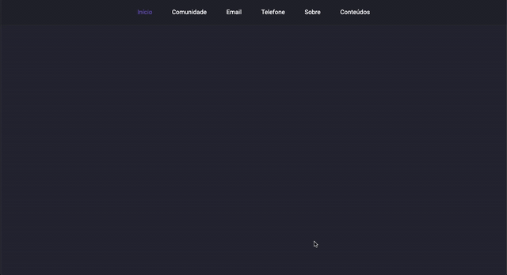

<h1 align="center">
  
</h1>
<h1 align="center">
  
</h1>

<p align="center">
  <a href="#sobre">Sobre</a> |
  <a href="#tecnologias-utilizadas">Tecnologias</a> |
  <a href="#objetivo">Objetivo</a> |
  <a href="#como-baixar-o-projeto">Baixar</a>

</p>

## Sobre
Primeiro sistema WEB front-end desenvolvido no curso **LaunchBase** da Rocketseat

## Tecnologias Utilizadas
- HTML
- CSS
- JavaScript

## Objetivo
Sistema tem como objetivo disponibilizar informações sobre a Rocketseat
Informações:
- Comunidade do Discord
- Email de contato
- Telefone
- Tecnologias utilizadas
- Redes sociais
- Cursos ofertados

## Como Baixar o projeto
Pelo seu terminal, escolha um local para o projeto e rode os comandos:
```bash
  # Clonar o repositório
  $ git clone https://github.com/luizcampos331/info-rocketseat.git

  # Entrar no diretório
  $ cd info-rocketseat

```